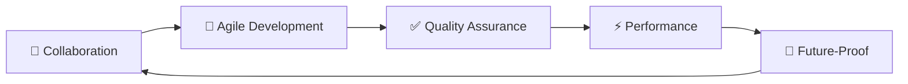

<div align="center">


<br/><br/>

# 🚀 HARGILE

### Digital Innovation Through Code Excellence

[](https://hargile.com)
[](https://maps.google.com/?q=Brussels,Belgium)
[](mailto:info@hargile.com)

<br/>


<br/>

**✨ Building tomorrow's digital solutions today ✨**

</div>

### 💳 E-commerce & Payment Integration Expertise

We specialize in complex payment integrations and e-commerce solutions:

- **Worldline SIPS Integration** - Certified expertise in SIPS Atos implementation
- **Multi-gateway Architecture** - Seamless switching between payment providers
- **Marketplace Solutions** - Split payments and vendor management
- **Custom E-commerce** - Tailored solutions beyond standard platforms

---

## 🎯 About Us

> **HARGILE** is a digital agency specializing in building innovative technology solutions that address strategic and operational challenges. We combine cutting-edge technology with human-centered design to deliver powerful digital experiences.

<table>
<tr>
<td width="33%" align="center">

### 💡 Innovation
Pushing boundaries with emerging technologies
<br/><br/>

</td>
<td width="33%" align="center">

### 🤝 Partnership
Working as an extension of your team
<br/><br/>

</td>
<td width="33%" align="center">

### 🔧 Excellence
Delivering quality through best practices
<br/><br/>

</td>
</tr>
</table>

---

## 🛠️ Tech Stack & Expertise

<div align="center">

### Frontend


### React Ecosystem


### Mobile


### Backend


### CMS & E-commerce


### Testing


### DevOps & Cloud


### Databases & Payment


### AI/ML


</div>

---

## 📋 Development Philosophy

<div align="center">

| Principle | Description |
|:---------|:------------|
| 🧪 **Test-Driven Development (TDD)** | Quality assured through comprehensive testing |
| 🏗️ **SOLID Principles** | Clean, maintainable, and scalable code architecture |
| 🎯 **Domain-Driven Design (DDD)** | Business logic at the heart of software design |
| 📡 **Event Sourcing** | Complete audit trail and temporal queries |
| 🔄 **CI/CD** | Automated workflows with GitHub Actions |
| 📝 **Code-First Documentation** | Self-explanatory code with minimal comments |
| 📘 **TypeScript First** | Type safety and enhanced developer experience |

</div>

### 🔧 Key Technologies & Frameworks

<table align="center">
<tr>
<td align="left" width="50%">

**Laravel Ecosystem** 🔴
- Spatie packages suite (Permissions, Media Library, etc.)
- Laravel Sanctum & Passport
- Laravel Livewire & Inertia.js
- Laravel Horizon, Telescope

</td>
<td align="left" width="50%">

**React Ecosystem** ⚛️
- TanStack Query (React Query)
- Material-UI (MUI) & Ant Design
- React Hook Form & Formik
- React Testing Library & Cypress
- Framer Motion & React Spring

</td>
</tr>
<tr>
<td align="left" width="50%">

**Vue.js Ecosystem** 💚
- Vuex & Pinia
- Vue Router & Vue i18n
- Vuetify, Quasar & Element Plus
- VueUse & Vuelidate
- Vite & Vue DevTools
- Nuxt.js modules ecosystem

</td>
<td align="left" width="50%">

**Payment Solutions** 💳
- Worldline SIPS Integration
- Stripe & Stripe Connect
- PayPal & Mollie APIs
- Laravel Cashier Integration
- Custom Payment Gateways

</td>
</tr>
<tr>
<td align="left" width="50%">

**DevOps & Tools** 🛠️
- Docker & Docker Compose
- GitHub Actions Workflows
- Linux Server Administration
- Nginx & Apache
- PM2 & Supervisor
- Monitoring (Sentry, New Relic)

</td>
<td align="left" width="50%">

**Testing Suite** 🧪
- PHPUnit & Pest PHP
- Jest & Vitest
- Cypress & Playwright
- React Testing Library
- Code Coverage Tools
- Performance Testing Tools

</td>
</tr>
</table>

---

## 🌟 Our Solutions

### 🎓 AGVES - Educational Management Platform
> **Revolutionary school management system transforming education administration**

<details>
<summary><b>View Features & Tech Stack</b></summary>

**Features:**
- 🔐 **Secure Authentication**: Encrypted credentials and NFC badges
- 💳 **Electronic Wallet**: Integrated financial transaction system
- 📊 **Financial Management**: Comprehensive budgeting and reporting
- 🚀 **Scalable Architecture**: Supporting thousands of concurrent users

**Tech Stack:** Laravel, Vue.js, MySQL, Redis, WebSockets, Docker

</details>

---

### 🚴 I GO - Electric Mobility Navigation
> **Innovative mobile app revolutionizing urban electric mobility**

<details>
<summary><b>View Features & Tech Stack</b></summary>

**Features:**
- 📍 **Real-time Updates**: Live charging station availability
- 🗺️ **Smart Routing**: Battery-aware route optimization
- 👥 **Community Features**: User-driven content and reviews
- 📱 **Cross-platform**: Native iOS and Android support
- 🔌 **Network Integration**: Multiple charging operators supported

**Tech Stack:** React Native, Node.js, MongoDB, GraphQL, Redis, Docker

</details>

---


## 💻 Technical Capabilities

### 🌐 Web Development
```
├── 📱 Progressive Web Applications (PWA)
├── ⚡ Server-Side Rendering (SSR) & Static Site Generation (SSG)
├── 🎨 Responsive Design with Mobile-First Approach
├── 🚀 Performance Optimization & SEO Best Practices
├── 🛒 E-commerce Platforms (PrestaShop, WooCommerce, Custom)
└── 📄 CMS Integration (WordPress, Drupal, Headless)
```

### 🔌 API & Backend Services
```
├── 🏗️ RESTful and GraphQL API Design
├── 🎯 Microservices Architecture
├── 📡 Event-Driven Systems & Event Sourcing
├── 🔄 Real-time Data Synchronization (WebSockets, SSE)
├── 🏦 Payment Gateway Integration (Worldline SIPS, Stripe, PayPal)
├── 🔐 OAuth2 & JWT Authentication
└── 🤝 Third-party Integrations (CRM, ERP, Marketing tools)
```

### ☁️ Cloud & DevOps
```
├── 🐳 Docker Containerization
├── 🚀 CI/CD with GitHub Actions
├── 🏗️ Infrastructure as Code (IaC)
├── 📊 Monitoring and Logging
├── 🐧 Linux Server Management
└── ⚖️ Auto-scaling and Load Balancing
```

### 📱 Mobile Development
```
├── ⚛️ React Native Cross-Platform
├── 🍎 Native iOS (Swift)
├── 🤖 Native Android (Kotlin)
├── 📲 Progressive Web Apps
└── 🔄 State Management (Redux, MobX)
```

### 🤖 AI & Machine Learning
```
├── 📈 Predictive Analytics Pipelines
├── 💬 Natural Language Processing (NLP)
├── 👁️ Computer Vision Applications
├── 🔧 Intelligent Automation
├── 🧠 Custom ML Model Development
└── 🤖 AI-Powered Chatbots & Assistants
```

### 🧪 Testing & Quality Assurance
```
├── 🔬 Unit Testing (Jest, Vitest, PHPUnit)
├── 🎭 E2E Testing (Cypress, Playwright)
├── 📊 Performance Testing
├── 🛡️ Security Testing
├── 📱 Mobile App Testing
└── 🔄 Continuous Testing in CI/CD
```

---

## 🚀 Our Approach

<div align="center">



</div>

1. **🤝 Collaborative Development**: Extension of your team
2. **🔄 Agile Methodology**: Iterative development with feedback
3. **✅ Quality First**: Comprehensive testing strategies
4. **⚡ Performance Focused**: Optimized for speed and efficiency
5. **🔮 Future-Proof Architecture**: Scalable solutions that grow

---

## 📂 Open Source Contributions

<div align="center">

| Type | Description |
|:----|:------------|
| 📦 **Laravel Packages** | Custom packages extending Laravel functionality |
| ⚛️ **React Components** | Reusable UI components and hooks |
| 🛠️ **Development Tools** | CLI tools, GitHub Actions, Docker configurations |
| 📚 **Code Examples** | Best practices implementations in various technologies |
| 📖 **Technical Guides** | Tutorials on TDD, DDD, and modern architecture patterns |

</div>

---

## 👥 Our Team

<div align="center">

> *Experienced full-stack developers specializing in PHP/Laravel, React/Vue.js ecosystems, cloud architects, and AI specialists passionate about creating innovative solutions*

**🌟 Always at the forefront of technology trends**  
**🏗️ Solid foundations in software engineering (SOLID, TDD, DDD)**  
**💡 Creative problem-solving with modern architecture patterns**  
**🚀 Expertise in both legacy system modernization and greenfield projects**

</div>

---

## 📬 Get In Touch

<div align="center">


<br>

### 🤔 Looking to collaborate?

*We're always interested in challenging projects that push the boundaries of technology*

**Specializing in:**
- 🏢 Enterprise Solutions (Laravel, React, Vue.js)
- 📱 Mobile Applications (React Native, Native iOS/Android)
- 🛒 E-commerce Platforms (PrestaShop, WooCommerce, Custom)
- 🤖 AI Integration & Automation
- 💳 Payment Gateway Integration (Worldline SIPS, Stripe)
- 🚀 Legacy System Modernization

<br>

*We're always interested in challenging projects that push the boundaries of technology*

<br>

**🌐 Website**: [hargile.com](https://hargile.com)  
**📧 Email**: [info@hargile.com](mailto:info@hargile.com)  
**📍 Location**: Brussels, Belgium

<br>

### 💬 Let's Build Something Amazing Together!

Whether you need a custom web application (Laravel, React, Vue.js), mobile solution (React Native),  
AI integration, or payment system implementation (Worldline SIPS),  
we're here to transform your ideas into reality using modern, scalable technologies.

</div>

---

<div align="center">

### 🌱 Our Commitment

> **Building tomorrow's digital solutions today**  
> *with clean code, innovative thinking, and sustainable practices*

<br>

**Core Stack:** Laravel | React | Vue.js | TypeScript | Docker | TDD | SOLID | DDD

<br>


<br>

**© 2025 HARGILE - Digital Innovation Agency**

</div>
